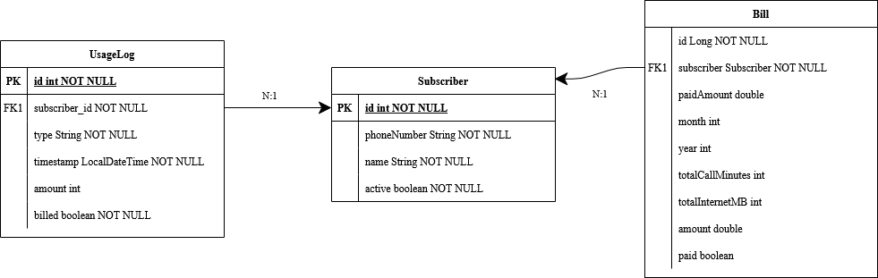

# SE 4458 Midterm Mobile Billing API

This project is a RESTful API for a mobile telecom billing system.

> [Video Presentation](https://drive.google.com/drive/folders/1_prYEIK7YUYO76JCcXEu7uxvQrSqoTcB?usp=sharing) *(Google Drive Link)*

> [Render Deployment](https://se4458-mobilebilling.onrender.com/swagger-ui/index.html) *(Swagger UI Link)*


---

## Features

- Subscriber registration 
- Usage logging (call & internet)
- Monthly billing calculation
- Partial and full payment handling
- JWT authentication (optional for production)
- Debug/testing endpoints for bulk usage creation and user lookup

---

## Technologies Used

- Java 17
- Spring Boot 3.x
- Spring Data JPA
- PostgreSQL (hosted on Render)
- pgAdmin 4
- Swagger/OpenAPI
- Maven Wrapper
- Docker (technically, theres a Dockerfile solely to deploy on Render)

---
## Project Structure
```

mobilebilling/
├── MobileBillingApplication.java       # Spring Boot application entry point

├── config/
│   └── OpenApiConfig.java              # Swagger / OpenAPI configuration

├── controllers/                        # API layer (handles HTTP requests)
│   ├── AuthController.java
│   ├── BillController.java
│   ├── SubscriberController.java
│   └── UsageController.java

├── dtos/                               # Data Transfer Objects
│   ├── BillDetailsDTO.java
│   ├── BillDTO.java
│   ├── BillSummaryDTO.java
│   ├── CreateSubscriberDTO.java
│   ├── SubscriberDTO.java
│   └── UsageLogDTO.java

├── entities/                           # JPA Entities (Database models)
│   ├── Bill.java
│   ├── Subscriber.java
│   └── UsageLog.java

├── exceptions/                         # Custom exceptions and global handler
│   ├── BillNotFoundException.java
│   ├── GlobalExceptionHandler.java
│   └── SubscriberNotFoundException.java

├── repositories/                       # Spring Data JPA Repositories
│   ├── BillRepository.java
│   ├── SubscriberRepository.java
│   └── UsageLogRepository.java

├── security/                           # JWT Security Configuration
│   ├── JwtFilter.java
│   ├── JwtUtil.java
│   └── SecurityConfig.java

└── services/                           # Business logic layer
    ├── BillingService.java
    ├── SubscriberService.java
    └── UsageService.java
```

## Data Model (ER Diagram)



Key entities:

- `Subscriber`: id, name, phone number, active
- `UsageLog`: id, subscriber, type (`call`/`internet`), timestamp, amount, billed
- `Bill`: id, subscriber, month, year, totalCallMinutes, totalInternetMB, amount, paidAmount, paid

---

## API Endpoints (Main)

usage-controller
| Method | Endpoint | Description |
|--------|----------|-------------|
| POST   | `/api/v1/usage/test/usage-bulk` | Add a new usage log with custom amount |
| POST   | `/api/v1/usage/add`         | Add new usage log |

subscriber-controller
| Method | Endpoint | Description |
|--------|----------|-------------|
| POST   | `/api/v1/subscribers`       | Register a new subscriber |
| GET    | `/api/v1/subscribers/test/{id}`  | Get subscriber info |

bill-controller
| Method | Endpoint | Description |
|--------|----------|-------------|
| POST   | `/api/v1/bill/pay`          | Pay (or partially pay) a calculated bill |
| POST   | `/api/v1/bill/calculate`    | Calculate a bill |
| GET    | `/api/v1/bill/query/{subscriberId}/{year}/{month}` | Get a specific bill |
| GET    | `/api/v1/bill/query/detailed/{subscriberId}` | Get details of all bills for user |

auth-controller
| Method | Endpoint | Description |
|--------|----------|-------------|
| POST   | `/api/v1/auth/login`    | Login |

---

## Authentication

The app supports JWT authentication via the `/auth` endpoint.
Login:
| Name  | Password |
|-------|----------|
| `admin` | `admin123` |
---

## Assumptions

- No in-memory database but an external Postgre database hosted by render.com is connected to test functionability.
- Assignment does not require a registiration system, so only name and password `admin` `admin123` is valid.
- No strict rules on what endpoints should or should not be, so test tools are not removed.
- No requirements about error-checking or how the functions work in detail so things such as bills worth $0 can be marked "unpaid" or users can be created with incorrect phone numbers.
- Each bill is generated once per month.
- Usage is **accumulated** before billing, then marked as "billed" to prevent duplication.
- The database connection is done internally within render.com so enviroment variables must be changed prior local hosting.
